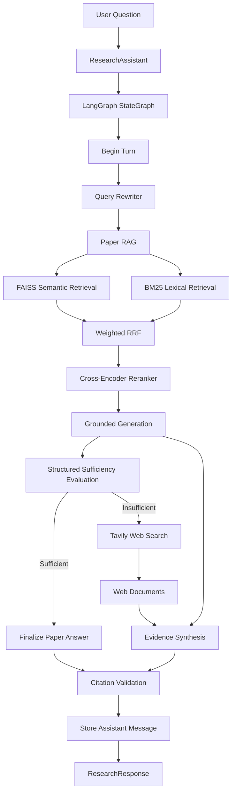
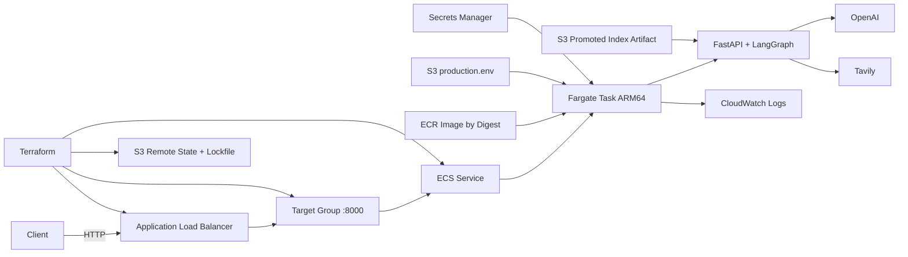

# 🔎 Agentic Research RAG

A general-purpose **agentic research assistant** for querying collections of PDF documents with **LangChain** and **LangGraph**.

The system follows a **paper-first research strategy**:

1. rewrite context-dependent follow-up questions into standalone research queries,
2. search the local PDF corpus first,
3. combine semantic and lexical retrieval,
4. rerank the strongest candidates,
5. generate a grounded answer with citations,
6. evaluate whether the local evidence is sufficient,
7. use web search only when the local evidence is insufficient,
8. synthesize local and web evidence into a final answer,
9. validate citation structure,
10. preserve conversational state through LangGraph checkpointing.

The project is designed as a modular, testable research workflow rather than a single `embed → retrieve → prompt` script.

---

## Key Features

- PDF ingestion with page-level metadata
- LangChain `Document` as the common evidence representation
- Recursive overlapping text splitting
- Local Hugging Face embeddings or OpenAI embeddings
- Persistent FAISS vector index
- Corpus fingerprinting and index metadata validation
- BM25 lexical retrieval
- Weighted Reciprocal Rank Fusion
- Cross-encoder reranking
- Grounded RAG generation with `ChatPromptTemplate`
- Structured sufficiency evaluation with Pydantic
- Paper-first conditional routing with LangGraph
- Tavily web-search fallback
- Multi-source evidence synthesis
- Unified `[SOURCE N]` citation space
- Structural citation validation
- Conversational memory with LangGraph `MessagesState`
- Context-aware query rewriting
- Public `ResearchAssistant` API
- FastAPI serving layer with liveness and readiness endpoints
- Offline index building separated from online serving
- Versioned FAISS artifacts published to S3 with explicit promotion
- Dockerized ARM64 runtime with CPU-only PyTorch
- AWS deployment on ECS Fargate behind an Application Load Balancer
- Secrets Manager and IAM role separation for runtime credentials
- Terraform-managed AWS runtime infrastructure
- Remote Terraform state in a private, versioned S3 backend with state locking
- Environment-driven configuration and deterministic tests

## Quickstart

Clone and install the project:

```bash
git clone https://github.com/carlosng95/agentic-research-rag.git
cd agentic-research-rag
python3 -m pip install -e ".[dev]"
cp .env.example .env
```

Add the required API keys to `.env`:

```env
OPENAI_API_KEY=
TAVILY_API_KEY=
```

Place text-based PDFs inside:

```text
papers/
```

Build the local retrieval artifact before starting the application:

```bash
python3 -m agentic_research_rag.indexing.build --force
```

Then use the Python API:

```python
from agentic_research_rag import build_assistant

assistant = build_assistant(thread_id = "research-session")

response = assistant.ask(
    "What are the main findings supported by the document collection?"
)

print(response.answer)
for source in response.sources:
    print(source.source_number, source.type, source.ref, source.locator)
```

For a follow-up question, reuse the same assistant and `thread_id`:

```python
response = assistant.ask("How does that compare with the previous point?")
print(response.answer)
```

For HTTP serving, start FastAPI with:

```bash
python3 -m uvicorn agentic_research_rag.serving.app:app --host 0.0.0.0 --port 8000
```

The serving process loads an existing index artifact; it does not ingest PDFs or rebuild the index during startup.

## Architecture

The application workflow is implemented as a deterministic LangGraph state machine:



The routing policy is deliberately deterministic:

```text
START
  ↓
rewrite query
  ↓
paper RAG
  ↓
evaluate local evidence
  ↓
      sufficient?
      /        \
    yes        no
     |          |
 finalize     web search
   paper         |
     |        synthesis
      \        /
       \      /
    validate citations
          ↓
         END
```

There is no route from `START` directly to web search. External search is only reachable after the local-evidence evaluator returns `sufficient = False`.

## Production Deployment Architecture

The production-oriented runtime separates offline indexing from online serving and deploys the API on AWS:



The online request path is:

```text
client
  ↓
ALB :80
  ↓
target group
  ↓
Fargate task private IP :8000
  ↓
FastAPI
  ↓
LangGraph
  ↓
FAISS + BM25 + cross-encoder
  ↓
OpenAI / optional Tavily
```

The ALB checks `/ready`, not `/health`, so traffic is only sent to a task after the RAG runtime has finished loading its promoted artifact and models.

The current deployment uses Fargate tasks with public IPs for outbound access to external APIs. Direct inbound traffic to port `8000` is blocked by the task security group; only the ALB security group can reach that port. A future hardening step is to move tasks to private subnets with controlled egress.

---

## Document Ingestion

PDF ingestion belongs to the **offline indexing path**, not the serving startup path.

PDFs are loaded with LangChain's `PyPDFLoader` in page mode. Each page becomes a LangChain `Document` whose metadata includes fields such as:

```python
{
    "source": "document.pdf",
    "document_name": "document.pdf",
    "page_number": 1,
}
```

Documents are then split with `RecursiveCharacterTextSplitter`.

Default configuration:

```env
CHUNK_SIZE=1200
CHUNK_OVERLAP=200
```

Every resulting chunk receives a corpus-wide `chunk_id`.

```text
PDF
 ↓
page Documents
 ↓
RecursiveCharacterTextSplitter
 ↓
chunk Documents
 ↓
global chunk_id
 ↓
offline index artifact
```

Build the artifact with:

```bash
python3 -m agentic_research_rag.indexing.build --force
```

The project currently expects text-based PDFs. OCR for scanned or image-only documents is not included.

## Embeddings

The embedding backend is configurable:

```env

EMBEDDING_BACKEND=local

```

Supported values:

```text

local

openai

```

Default local model:

```text

sentence-transformers/all-MiniLM-L6-v2

```

Default OpenAI embedding model:

```text

text-embedding-3-small

```

The local backend uses LangChain's Hugging Face embeddings integration. The OpenAI backend uses `OpenAIEmbeddings`.

---

## Semantic Retrieval with FAISS

The semantic index is implemented with FAISS through LangChain.

The index artifact contains:

```text
data/indexes/faiss/
├── index.faiss
├── index.pkl
├── documents.jsonl
└── metadata.json
```

`documents.jsonl` preserves the chunk corpus required to reconstruct lexical retrieval, while the FAISS files persist semantic retrieval state.

The vector store uses L2-normalized vectors and Euclidean distance. For normalized vectors:

```text
||q - d||² = 2 - 2(q · d)
```

so minimizing Euclidean distance produces the same ranking as maximizing cosine similarity.

### Index validation

`metadata.json` records artifact metadata such as:

```text
schema version
corpus fingerprint
embedding model identifier
document count
chunk size
chunk overlap
```

The corpus fingerprint is derived from retrieval-relevant chunk content and metadata. The serving process validates the artifact before loading it and rejects incompatible or incomplete artifacts.

Index construction is intentionally offline. The API does **not** rebuild FAISS when it starts; a new artifact must be built and, for S3 deployments, explicitly uploaded and promoted.

### Security note

LangChain FAISS persistence uses a pickle-backed document store. The application therefore treats index artifacts as trusted internal artifacts.

Do **not** load FAISS index directories from untrusted sources.

## BM25 Lexical Retrieval

Semantic search is complemented by LangChain's `BM25Retriever`.

The project applies a lightweight tokenizer:

```python

r"\b\w+\b"

```

with lowercase normalization.

BM25 is useful when exact terminology matters, including:

- acronyms
- model names
- technical terms
- identifiers
- uncommon keywords
- domain-specific vocabulary

The lexical layer currently does not apply stemming or stopword removal.

---

## Weighted Reciprocal Rank Fusion

Semantic and BM25 scores live in different score spaces, so they are not directly combined.

Instead, the project fuses the two rankings with weighted Reciprocal Rank Fusion:

```text

contribution = weight / (rrf_k + rank)

```

Default configuration:

```env

RRF_K=60

SEMANTIC_WEIGHT=0.5

BM25_WEIGHT=0.5

RETRIEVAL_CANDIDATE_K=30

RERANK_K=20

FINAL_K=5

```

The default retrieval flow is:

```text

FAISS → Top 30 ───┐

                  ├── weighted RRF → Top 20

BM25  → Top 30 ───┘

                         ↓

                 Cross-Encoder

                         ↓

                       Top 5

```

Documents that appear in both rankings accumulate contributions from both retrieval methods.

---

## Cross-Encoder Reranking

The fused candidates are reranked with:

```text

cross-encoder/ms-marco-MiniLM-L6-v2

```

A bi-encoder compares independently generated vectors:

```text

query → encoder → query vector

                       \

                        similarity

                       /

document → encoder → document vector

```

The cross-encoder instead scores each pair jointly:

```text

(query, document)

        ↓

  cross-encoder

        ↓

 relevance score

```

This is more expensive, so it is only applied to the fused candidate set rather than the entire corpus.

---

## Grounded RAG Generation

The final local documents are formatted into an explicit evidence context:

```text

[SOURCE 1]

Document: document.pdf

Page: 4

Chunk ID: 37

Retrieved evidence...

---

[SOURCE 2]

Document: another_document.pdf

Page: 9

Chunk ID: 104

Retrieved evidence...

```

The RAG chain is composed with LangChain:

```text

Retriever

   ↓

Document[]

   ↓

context formatting

   ↓

ChatPromptTemplate

   ↓

ChatOpenAI

   ↓

StrOutputParser

```

The prompt instructs the model to:

- answer only from the supplied evidence,
- avoid unsupported external knowledge,
- use `[SOURCE N]` citations,
- never invent source numbers,
- explicitly acknowledge insufficient evidence.

If retrieval returns no documents, the chain skips the LLM call and returns a deterministic fallback response.

---

## Structured Evidence Sufficiency

After the local RAG answer is generated, a separate evaluator decides whether the local evidence is sufficient.

The evaluator receives:

```text

standalone question

+

current local answer

+

retrieved local evidence

```

It uses Pydantic structured output:

```python

class SufficiencyResult(BaseModel):

    sufficient: bool

```

This avoids fragile string parsing such as:

```text

"SUFFICIENT"

"INSUFFICIENT"

```

The boolean directly controls the LangGraph conditional edge.

If no local documents exist, the evaluator returns `sufficient = False` without calling the LLM.

---

## Paper-First Routing with LangGraph

The research workflow is represented explicitly with a `StateGraph`.

The core policy is:

```text

local documents first

        ↓

evaluate evidence

        ↓

web only if required

```

This constraint is encoded in graph topology rather than left to an unconstrained agent prompt.

Conceptually:

```text

evaluate

   ↓

sufficient == True  ───→ finalize_paper

sufficient == False ───→ web_search

```

This makes the workflow agentic while keeping tool execution deterministic and auditable.

---

## Web Search Fallback

When local evidence is insufficient, the graph invokes Tavily through the LangChain `TavilySearch` integration.

The search layer requests structured search evidence rather than a generated final answer.

Each result is normalized into the same LangChain `Document` abstraction used by the local corpus:

```python

Document(

    page_content = "Relevant web evidence...",

    metadata = {

        "source": "https://example.com/article",

        "url": "https://example.com/article",

        "title": "Article title",

        "web_rank": 1,

        "search_score": 0.91,

    },

)

```

This produces one evidence type throughout the rest of the application:

```text

local retrieval → Document[]

web search      → Document[]

```

Duplicate web URLs are removed.

---

## Evidence Synthesis

When web fallback is required, local evidence is retained.

The synthesis chain receives:

```text

paper_documents

+

web_documents

```

rather than treating previously generated answers as evidence.

This avoids propagating unsupported text from an earlier generation step.

The final context uses a unified source-numbering space:

```text

SOURCE 1..N     → local documents

SOURCE N+1..M   → web documents

```

The synthesis prompt instructs the model to:

- prefer direct local evidence when it is sufficient,
- use web evidence to fill missing information,
- cite all factual claims,
- describe disagreements between sources explicitly,
- avoid unsupported external knowledge.

---

## Citation Validation

The final answer is checked by a custom structural citation validator.

It extracts citations such as:

```text

[SOURCE 1]

[SOURCE 3]

```

and verifies that:

- each citation is well formed,
- source numbers start at 1,
- every cited source exists in the final evidence set.

Examples:

```text

[SOURCE 1]     valid format

[SOURCE 12]    valid format

[SOURCE 0]     invalid source number

[SOURCE abc]   malformed

[SOURCE 99]    invalid if only five sources exist

```

The validator distinguishes:

```text

valid citations

citations present

invalid source numbers

malformed citation tokens

```

This is ****structural validation, not semantic entailment****.

A real source can still be cited next to a claim it does not support. Claim-level entailment verification is a possible future extension.

---

## Conversational Memory

The graph state inherits from LangGraph `MessagesState`.

Conversation messages therefore use LangChain message objects:

```text

HumanMessage

AIMessage

```

rather than a custom turn abstraction.

At the end of each request:

```text

HumanMessage(current question)

+

AIMessage(final answer)

```

become part of the graph state.

The default bootstrap uses:

```python

InMemorySaver()

```

as the checkpointer.

A conversation is identified by `thread_id`.

```python

assistant = build_assistant(

    thread_id = "conversation-a"

)

```

Calling:

```python

assistant.ask("First question")

assistant.ask("Follow-up question")

```

reuses the same conversation state.

### Memory window

```env

MEMORY_TURNS=5

```

controls how much prior history is provided to the query rewriter.

`InMemorySaver` is process-local. Conversation state is lost when the Python process exits.

A persistent checkpointer should be used for production deployments.

---

## Context-Aware Query Rewriting

Follow-up questions can contain unresolved references.

Example:

```text

User:

How does semantic retrieval work?

Assistant:

...

User:

How does it differ from lexical retrieval?

```

The latest question alone is ambiguous.

Before retrieval, the query-rewrite chain receives previous `HumanMessage` and `AIMessage` objects through a `MessagesPlaceholder` and can produce a standalone query such as:

```text

How does semantic retrieval differ from lexical retrieval?

```

The original user question remains unchanged in conversation history.

If there is no previous history, the query is returned unchanged and the LLM is not called.

---

## LangGraph State

The workflow state includes fields such as:

```text

messages

question

standalone_query

paper_documents

paper_answer

sufficient

web_documents

final_documents

final_answer

citation_valid

citation_has_citations

cited_source_numbers

invalid_source_numbers

malformed_citations

tools_used

flags

```

Nodes return partial state updates.

For example:

```text

rewrite_query

    → standalone_query

paper_rag

    → paper_documents

    → paper_answer

evaluate

    → sufficient

web_search

    → web_documents

synthesize

    → final_documents

    → final_answer

```

`messages` uses LangGraph's message reducer so conversation messages accumulate rather than being overwritten.

---

## Structured Public API

The public API hides the internal LangGraph state.

```python

from agentic_research_rag import build_assistant


assistant = build_assistant(

    thread_id = "demo"

)

response = assistant.ask(

    "What conclusions are supported by the documents?"

)

```

The returned object is a Pydantic model:

```python

ResearchResponse(

    answer = "...",

    sources = [...],

    cited_source_numbers = [1, 3],

    tools_used = ["paper_retrieval"],

    flags = [],

    paper_evidence_sufficient = True,

    citation_valid = True,

)

```

Each source is represented as:

```python

Source(

    source_number = 1,

    type = "paper",

    ref = "document.pdf",

    locator = "page 4",

    snippet = "...",

)

```

or:

```python

Source(

    source_number = 6,

    type = "web",

    ref = "https://example.com/article",

    locator = "https://example.com/article",

    snippet = "...",

)

```

The application deliberately does not expose a fabricated confidence score.

---

## FastAPI Serving Layer

The production entry point is `agentic_research_rag.serving.app:app`.

The API exposes:

```text
GET  /health
GET  /ready
POST /research
```

`/health` is a liveness endpoint. It returns `200` when the FastAPI process is alive.

`/ready` is a readiness endpoint. It returns `503` while the application is still materializing the index or loading the retrieval stack, and `200` only after the graph is ready to serve traffic.

`POST /research` accepts a request such as:

```json
{
  "question": "What conclusions are supported by the documents?",
  "thread_id": "example-thread"
}
```

Heavy initialization is performed once during application startup and shared across requests. A lightweight `ResearchAssistant` is created per request around the shared compiled graph.

Request middleware attaches or preserves an `X-Request-ID`, records request duration, and writes structured operational information to the Uvicorn logger without logging the research question body.

The default LangGraph checkpointer is still `InMemorySaver`, so conversational state is process-local and is lost when a Fargate task is replaced.

---

## Offline Indexing and Versioned S3 Artifacts

Serving and indexing are intentionally separate workloads.

```text
PDF corpus
   ↓
offline index builder
   ↓
FAISS + documents + metadata
   ↓
upload immutable version
   ↓
validate / evaluate
   ↓
promote version
   ↓
current.json
   ↓
serving materializes promoted version
```

The S3 layout is:

```text
<artifact-prefix>/indexes/
├── versions/
│   └── <version>/
│       ├── index.faiss
│       ├── index.pkl
│       ├── documents.jsonl
│       └── metadata.json
└── manifests/
    └── current.json
```

A version identifier is generated from a UTC timestamp plus the corpus fingerprint prefix. Uploading and promoting are deliberately separate operations:

```bash
python3 -m agentic_research_rag.artifacts.publish upload
python3 -m agentic_research_rag.artifacts.publish promote --version <version>
```

This provides a simple deployment boundary:

```text
build → upload → validate/evaluate → promote
```

The serving layer reads `current.json`, downloads the promoted artifact to a temporary directory, validates it, and only then replaces the active local index directory. A local `.artifact-version` marker is used to avoid downloading the same promoted version again.

---

## Containerization

The API is packaged as a multi-stage Docker image based on Python 3.11 slim.

The runtime image:

- runs as a non-root user,
- installs CPU-only PyTorch,
- includes `libgomp1` for model runtime support,
- keeps Hugging Face cache under the application user home,
- excludes PDFs, local indexes, tests, notebooks, secrets, and development artifacts through `.dockerignore`,
- exposes port `8000`,
- starts Uvicorn with `agentic_research_rag.serving.app:app`.

The currently validated AWS image target is `linux/arm64`, matching the ECS Fargate task definition.

---

## AWS Runtime

The AWS deployment uses the following responsibilities:

| Component                 | Responsibility                                                                                       |
| ------------------------- | ---------------------------------------------------------------------------------------------------- |
| Amazon ECR                | Stores immutable application container images                                                        |
| Amazon ECS / Fargate      | Runs the FastAPI RAG service without managing EC2 hosts                                              |
| Application Load Balancer | Provides a stable HTTP endpoint and health-aware routing                                             |
| Target Group              | Registers Fargate task private IPs on port`8000`                                                   |
| Amazon S3                 | Stores promoted index artifacts and the non-secret production environment file                       |
| AWS Secrets Manager       | Stores external API keys                                                                             |
| IAM Task Role             | Grants the running application access to the promoted S3 artifacts                                   |
| IAM Execution Role        | Lets ECS pull ECR images, fetch the S3 environment file and Secrets Manager values, and publish logs |
| CloudWatch Logs           | Receives container logs                                                                              |

The ECS service uses a deployment circuit breaker with rollback enabled and a readiness grace period so model/index initialization is not mistaken for a failed deployment.

### Runtime security model

The deployment deliberately avoids static AWS credentials inside the container.

```text
ECS control plane
    ↓ Execution Role
ECR / environment file / Secrets Manager / logs

application Python process
    ↓ Task Role
S3 promoted artifacts
```

The ALB security group accepts HTTP only from the configured client CIDR. The Fargate security group accepts application traffic on port `8000` only from the ALB security group.

Secret values are not stored in `production.env` or Terraform configuration. ECS injects individual JSON keys from Secrets Manager at task startup.

---

## Terraform Infrastructure

The AWS runtime is declared under `infra/terraform/`.

Terraform manages the **disposable runtime layer** while persistent foundation resources are referenced with data sources.

### Persistent foundation

These resources are expected to exist independently of the runtime Terraform lifecycle:

```text
S3 artifact bucket
ECR repository
Secrets Manager secret
ECS task role
ECS execution role
CloudWatch log group
VPC and subnets
Terraform state bucket
```

### Terraform-managed runtime

Terraform creates and destroys:

```text
ALB security group
Fargate security group
security-group rules
Application Load Balancer
Target Group
HTTP Listener
ECS Cluster
ECS Task Definition
ECS Service
```

The task definition resolves the application image from an immutable ECR tag to an image digest and deploys that digest to ECS.

### Remote state and locking

Terraform state is stored in a dedicated private S3 backend rather than in Git or only on one developer machine.

The backend uses:

```text
server-side encryption
S3 versioning
public-access blocking
S3 native lockfile
```

The state key is:

```text
production/terraform.tfstate
```

`use_lockfile = true` prevents concurrent Terraform writers from updating the same state simultaneously.

Neither `terraform.tfstate` nor `.tfplan` files are committed to Git. `.terraform.lock.hcl` **is** committed so provider selections and checksums remain reproducible.

### Local Terraform workflow

Authenticate through the dedicated Terraform role/profile, then configure the client CIDR accepted by the public ALB:

```bash
cd infra/terraform

export AWS_PROFILE=agentic-rag-terraform
export TF_VAR_alb_ingress_cidr="$(curl -s https://checkip.amazonaws.com | tr -d '\n')/32"

terraform init
terraform fmt -check
terraform validate
terraform plan
```

To create the runtime:

```bash
terraform plan -out=tfplan
terraform apply tfplan
```

To verify the deployment after the target becomes healthy:

```bash
ALB_DNS="$(terraform output -raw alb_dns_name)"

curl -i "http://${ALB_DNS}/health"
curl -i "http://${ALB_DNS}/ready"
```

To remove the billable runtime while preserving artifacts, images, secrets, IAM foundation, and the remote Terraform state:

```bash
terraform plan -destroy
terraform destroy
```

Because the persistent AWS foundation is referenced through `data` sources, destroying the runtime does not delete the artifact bucket, ECR repository, Secrets Manager secret, ECS IAM roles, or CloudWatch log group.

This makes the development lifecycle intentionally reproducible and cost-aware:

```text
terraform apply
    ↓
recreate runtime
    ↓
validate service
    ↓
terraform destroy
    ↓
remove Fargate + ALB runtime
```

---

## Deployment Lifecycle

A full deployment can be understood as two independent pipelines.

**Artifact pipeline:**

```text
PDFs
 ↓
build index
 ↓
upload immutable S3 version
 ↓
validate / evaluate
 ↓
promote current version
```

**Application/runtime pipeline:**

```text
source code
 ↓
Docker build
 ↓
ECR immutable image
 ↓
Terraform Task Definition
 ↓
ECS Service deployment
 ↓
ALB readiness checks
```

This separation allows the application image and retrieval corpus to evolve independently while both remain explicitly versioned.

---

## Project Structure

```text
agentic-research-rag/
├── agentic_research_rag/
│   ├── __init__.py
│   ├── assistant.py
│   ├── bootstrap.py
│   ├── citation_validator.py
│   ├── config.py
│   ├── artifacts/
│   │   ├── __init__.py
│   │   ├── materialize.py
│   │   ├── publish.py
│   │   └── s3_store.py
│   ├── chains/
│   │   ├── __init__.py
│   │   ├── model.py
│   │   ├── query_rewriter.py
│   │   ├── rag.py
│   │   ├── sufficiency.py
│   │   └── synthesis.py
│   ├── graph/
│   │   ├── __init__.py
│   │   ├── research_graph.py
│   │   └── state.py
│   ├── indexing/
│   │   ├── __init__.py
│   │   └── build.py
│   ├── ingestion/
│   │   ├── __init__.py
│   │   └── documents.py
│   ├── retrieval/
│   │   ├── __init__.py
│   │   ├── embeddings.py
│   │   ├── hybrid.py
│   │   ├── index_manager.py
│   │   └── reranker.py
│   ├── serving/
│   │   ├── __init__.py
│   │   ├── app.py
│   │   └── schemas.py
│   └── tools/
│       ├── __init__.py
│       └── web_search.py
├── infra/
│   └── terraform/
│       ├── .terraform.lock.hcl
│       ├── alb.tf
│       ├── data.tf
│       ├── ecs.tf
│       ├── network.tf
│       ├── outputs.tf
│       ├── providers.tf
│       ├── variables.tf
│       └── versions.tf
├── tests/
├── papers/
│   └── .gitkeep
├── data/
│   └── indexes/
│       └── .gitkeep
├── .dockerignore
├── .env.example
├── .gitignore
├── Dockerfile
├── pyproject.toml
└── README.md
```

Local PDFs, generated indexes, `.env`, Terraform state and plan files, caches, notebooks, and IDE artifacts are excluded from version control.

## Configuration

Create `.env` from the template:

```bash
cp .env.example .env
```

Representative configuration:

```env
# API keys
OPENAI_API_KEY=
TAVILY_API_KEY=
GOOGLE_API_KEY=

# AWS / artifacts
AWS_REGION=us-east-1
ARTIFACT_SOURCE=local
ARTIFACT_BUCKET=
ARTIFACT_PREFIX=agentic-research-rag
INDEX_DIR=data/indexes/faiss

# Embeddings
EMBEDDING_BACKEND=local
LOCAL_EMBEDDING_MODEL=sentence-transformers/all-MiniLM-L6-v2
OPENAI_EMBEDDING_MODEL=text-embedding-3-small

# Reranking
CROSS_ENCODER_MODEL=cross-encoder/ms-marco-MiniLM-L6-v2

# LLM
LLM_MODEL=gpt-4o-mini
LLM_TEMPERATURE=0.0

# Document ingestion
CHUNK_SIZE=1200
CHUNK_OVERLAP=200

# Hybrid retrieval
RRF_K=60
SEMANTIC_WEIGHT=0.5
BM25_WEIGHT=0.5
RETRIEVAL_CANDIDATE_K=30
RERANK_K=20
FINAL_K=5

# Conversation memory
MEMORY_TURNS=5
```

For a production S3-backed runtime, configure:

```env
ARTIFACT_SOURCE=s3
ARTIFACT_BUCKET=<artifact-bucket>
INDEX_DIR=/app/data/indexes/faiss
```

Non-secret production configuration can be supplied to ECS through an S3 environment file. API keys are injected separately from Secrets Manager.

`Settings.from_env()` validates application configuration. Examples of invalid configurations include:

```text
CHUNK_OVERLAP >= CHUNK_SIZE
unsupported ARTIFACT_SOURCE
unsupported EMBEDDING_BACKEND
SEMANTIC_WEIGHT < 0
BM25_WEIGHT < 0
SEMANTIC_WEIGHT == 0 and BM25_WEIGHT == 0
RERANK_K > combined retrieval candidates
FINAL_K > RERANK_K
LLM_TEMPERATURE outside [0, 2]
```

AWS credentials are not application settings. Local development uses the standard AWS credential chain/profile mechanism, while ECS uses IAM roles.

## Building the Application

The application now has separate composition paths for online serving and offline indexing.

### Online serving

`agentic_research_rag/bootstrap.py` wires together:

```text
Settings
 ↓
Embedding implementation
 ↓
validated existing index artifact
 ↓
FAISS semantic retriever + BM25
 ↓
Weighted RRF
 ↓
Cross-encoder reranker
 ↓
ChatOpenAI
 ↓
RAG / rewrite / sufficiency / synthesis chains
 ↓
TavilySearch
 ↓
LangGraph
```

The serving layer can materialize the promoted S3 artifact before calling `build_application()`.

### Offline indexing

`agentic_research_rag/indexing/build.py` handles:

```text
PDF ingestion
 ↓
chunking
 ↓
embeddings
 ↓
FAISS construction
 ↓
documents.jsonl
 ↓
metadata validation
 ↓
local artifact
```

For normal Python use, prefer `build_assistant()`. For HTTP deployments, use the FastAPI application.

## Testing

Install development dependencies:

```bash
python3 -m pip install -e ".[dev]"
```

Check the environment:

```bash
python3 -m pip check
```

Run the complete suite:

```bash
python3 -m pytest -v
```

The deterministic suite covers the research workflow as well as the newer production boundaries, including:

- configuration validation
- document splitting and metadata preservation
- embedding factories
- FAISS construction, persistence, and artifact validation
- corpus and embedding-model invalidation
- semantic retrieval and BM25 tokenization
- weighted RRF and cross-encoder reranking
- RAG context formatting and grounded generation control flow
- structured sufficiency evaluation
- context-aware query rewriting
- web result normalization and evidence synthesis
- citation validation
- LangGraph state reducers and conditional routing
- conversation checkpointing
- application bootstrap wiring
- public `ResearchAssistant` behavior
- FastAPI schemas, readiness, initialization, and request handling
- S3 artifact upload, promotion, download, and validation
- promoted-artifact materialization and local cache reuse

External services and large models are replaced with deterministic test doubles where appropriate, keeping the test suite network-independent where possible.

## Design Principles

### Framework primitives for generic infrastructure

Generic infrastructure relies on LangChain and LangGraph abstractions:

```text

Document

Embeddings

BaseRetriever

BaseCrossEncoder

BaseChatModel

ChatPromptTemplate

Runnable

BaseTool

MessagesState

StateGraph

checkpointing

```

### Custom logic for application-specific behavior

The project retains custom code where the behavior is specific to this application:

```text

corpus fingerprinting

index invalidation

weighted rank fusion

source normalization

citation syntax validation

paper-first routing policy

```

The goal is not to use a framework in every function. The goal is to use framework abstractions where they reduce boilerplate without hiding application-specific decisions.

### Dependency injection

Factories and builders accept their dependencies explicitly.

Examples:

```text

build_rag_chain(retriever, model)

build_research_graph(

    query_rewriter,

    rag_chain,

    sufficiency_chain,

    web_search_tool,

    synthesis_chain,

)

```

This keeps components independently testable.

### Paper-first research

Local evidence is always attempted before external search.

The rule is enforced by graph topology rather than model discretion.

### Explicit grounding

Evidence remains represented as `Document` objects through retrieval, reranking, generation, synthesis, and response construction.

### Observable execution without chain-of-thought

The public response can expose:

```text

tools_used

flags

paper_evidence_sufficient

citation_valid

```

These describe observable workflow behavior, not private model reasoning.

---

## Technology Stack

| Layer                  | Technology                                          |
| ---------------------- | --------------------------------------------------- |
| Language               | Python 3.11+                                        |
| Agent orchestration    | LangGraph                                           |
| LLM abstraction        | LangChain Core                                      |
| LLM                    | ChatOpenAI                                          |
| Prompt composition     | ChatPromptTemplate / LCEL                           |
| Structured output      | Pydantic                                            |
| PDF ingestion          | PyPDFLoader / pypdf                                 |
| Text splitting         | RecursiveCharacterTextSplitter                      |
| Local embeddings       | Hugging Face / Sentence Transformers                |
| Optional embeddings    | OpenAIEmbeddings                                    |
| Vector retrieval       | FAISS                                               |
| Lexical retrieval      | BM25                                                |
| Rank fusion            | Weighted Reciprocal Rank Fusion                     |
| Reranking              | Hugging Face Cross-Encoder                          |
| Web search             | Tavily                                              |
| Conversational state   | MessagesState                                       |
| Checkpointing          | InMemorySaver by default                            |
| HTTP API               | FastAPI / Uvicorn                                   |
| Containerization       | Docker, multi-stage Python slim image               |
| Container registry     | Amazon ECR                                          |
| Compute                | Amazon ECS on AWS Fargate                           |
| Load balancing         | Application Load Balancer                           |
| Artifact storage       | Amazon S3                                           |
| Secret storage         | AWS Secrets Manager                                 |
| IAM                    | ECS Task Role / ECS Execution Role / Terraform role |
| Logging                | Amazon CloudWatch Logs                              |
| Infrastructure as Code | Terraform                                           |
| Terraform state        | Private versioned S3 backend with lockfile          |
| Configuration          | python-dotenv + ECS environment file                |
| Testing                | pytest                                              |
| Packaging              | setuptools / pyproject.toml                         |

## Current Scope

The repository now covers the full path from research workflow to reproducible AWS serving infrastructure.

Included today:

- agentic paper-first RAG workflow
- offline PDF indexing
- persistent local FAISS artifacts
- versioned S3 index artifacts with explicit promotion
- FastAPI REST serving
- Docker packaging
- ECR image storage
- ECS Fargate deployment
- Application Load Balancer routing and readiness checks
- IAM role separation and Secrets Manager integration
- CloudWatch container logging
- Terraform-managed runtime infrastructure
- remote Terraform state with S3 versioning and locking

The current deployment intentionally does **not** yet include:

- end-user authentication or authorization
- HTTPS / custom domain / ACM certificate
- WAF or public API rate limiting
- private-subnet Fargate with NAT or VPC endpoint design
- production-grade persistent LangGraph conversation storage
- ECS autoscaling
- automated CI/CD deployment
- full distributed tracing and application metrics
- automated RAG quality evaluation gates
- OCR
- a web frontend

## Known Limitations

- **Citation validation is structural, not semantic.** `[SOURCE N]` is checked for existence and format, but the validator does not prove that the source entails the claim.
- **PDF ingestion is text-only.** Scanned or image-only documents require OCR, which is not included. Complex multi-column PDFs may also reduce extraction quality.
- **Chunking is character-based.** `RecursiveCharacterTextSplitter` uses character length in the current configuration rather than model-token counts.
- **The default local embedding model is English-centric.** Multilingual corpora may benefit from a multilingual embedding model.
- **BM25 preprocessing is deliberately simple.** It uses lowercase regex tokenization without stemming or stopword removal.
- **Cross-encoder scores are ranking signals, not calibrated probabilities.** The public API intentionally does not expose a fabricated confidence value.
- **Sufficiency evaluation requires an additional LLM call.** Follow-up rewriting, local generation, evaluation, and optional synthesis can increase latency and cost.
- **Web fallback requires Tavily.** A valid `TAVILY_API_KEY` is required when the graph needs external evidence.
- **Default conversational memory is process-local.** `InMemorySaver` loses state when a process or Fargate task exits.
- **FAISS persistence uses pickle-backed data.** Only trusted internally generated artifacts should be loaded.
- **The current ALB listener is HTTP.** HTTPS termination and custom-domain configuration are not yet included.
- **The current Fargate networking favors simplicity.** Tasks receive public IPs for outbound access; private subnets and controlled egress are a future hardening step.
- **No production authentication, rate limiting, or autoscaling layer is included yet.**

## Potential Extensions

Possible future improvements include:

- token-aware chunking
- multilingual retrieval defaults
- persistent LangGraph checkpointing
- PostgreSQL-backed conversation state
- asynchronous execution and streaming responses
- metadata filtering and document-level retrieval constraints
- web evidence reranking and raw webpage extraction
- semantic citation entailment verification
- calibrated uncertainty estimation
- retrieval evaluation datasets
- Recall@K / MRR / nDCG tracking
- automated RAG evaluation pipelines and deployment quality gates
- multiple web-search providers
- additional document formats and OCR
- HTTPS with ACM and a custom domain
- authentication and authorization
- private-subnet ECS networking with NAT or VPC endpoints
- ECS autoscaling
- AWS WAF and API-level rate limiting
- GitHub Actions CI/CD with AWS OIDC
- OpenTelemetry / X-Ray tracing
- CloudWatch application metrics and alarms
- cost and token-usage monitoring
- blue/green or canary deployment strategies
- a web frontend

## Summary

This project implements an end-to-end agentic RAG system and a reproducible AWS deployment path built around:

```text
LangChain Documents
        +
Hybrid Retrieval
        +
FAISS + BM25
        +
Weighted RRF
        +
Cross-Encoder Reranking
        +
Grounded Generation
        +
Structured Evidence Evaluation
        +
Conditional Web Research
        +
Evidence Synthesis
        +
Citation Validation
        +
LangGraph Memory and Routing
        +
FastAPI Serving
        +
Versioned S3 Retrieval Artifacts
        +
Docker + ECR
        +
ECS Fargate + ALB
        +
Terraform Infrastructure as Code
```

Rather than treating RAG as:

```text
embed → retrieve → prompt
```

the system models research as a stateful workflow in which retrieval quality, evidence sufficiency, source provenance, conversation context, fallback behavior, citation integrity, artifact promotion, runtime readiness, and infrastructure reproducibility are explicit architectural concerns.

The application and corpus lifecycles are deliberately independent: container images are versioned in ECR, retrieval artifacts are versioned and promoted in S3, and the disposable AWS runtime can be recreated or destroyed through Terraform without deleting the persistent foundation.
