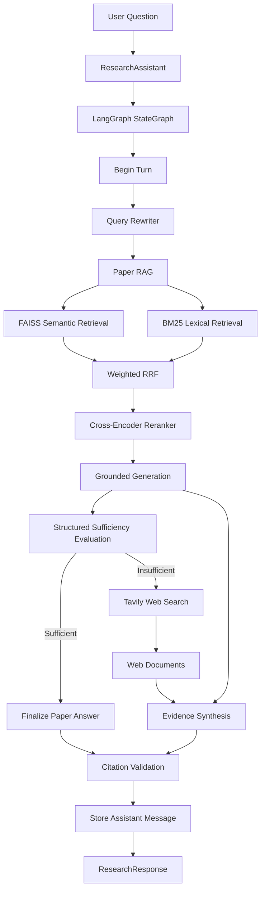

# 🔎 Agentic Research RAG

A general-purpose **agentic research assistant** for querying collections of PDF documents with **LangChain** and **LangGraph**.

The system follows a **paper-first research strategy**:

1. rewrite context-dependent follow-up questions into standalone research queries,
2. search the local PDF corpus first,
3. combine semantic and lexical retrieval,
4. rerank the strongest candidates,
5. generate a grounded answer with citations,
6. evaluate whether the local evidence is sufficient,
7. use web search only when the local evidence is insufficient,
8. synthesize local and web evidence into a final answer,
9. validate citation structure,
10. preserve conversational state through LangGraph checkpointing.

The project is designed as a modular, testable research workflow rather than a single `embed → retrieve → prompt` script.

---

## Key Features

- PDF ingestion with page-level metadata
- LangChain `Document` as the common evidence representation
- Recursive overlapping text splitting
- Local Hugging Face embeddings or OpenAI embeddings
- Persistent FAISS vector index
- Corpus fingerprinting and automatic index invalidation
- BM25 lexical retrieval
- Weighted Reciprocal Rank Fusion
- Cross-encoder reranking
- Grounded RAG generation with `ChatPromptTemplate`
- Structured sufficiency evaluation with Pydantic
- Paper-first conditional routing with LangGraph
- Tavily web-search fallback
- Multi-source evidence synthesis
- Unified `[SOURCE N]` citation space
- Structural citation validation
- Conversational memory with LangGraph `MessagesState`
- Context-aware query rewriting
- Public `ResearchAssistant` API
- Environment-driven configuration
- 86 deterministic tests

---

## Quickstart

```bash
git clone https://github.com/carlosng95/agentic-research-rag.git
cd agentic-research-rag

python3 -m pip install -e ".[dev]"
cp .env.example .env
```

Add your API keys to `.env`:

```env
OPENAI_API_KEY=
TAVILY_API_KEY=
```

Place your PDFs inside:

```text
papers/
```

Then run:

```python
from agentic_research_rag import build_assistant


assistant = build_assistant(
    thread_id = "research-session"
)

response = assistant.ask(
    "What are the main findings supported by the document collection?"
)

print(response.answer)

for source in response.sources:
    print(
        source.source_number,
        source.type,
        source.ref,
        source.locator,
    )
```

For a follow-up question, reuse the same assistant:

```python
response = assistant.ask(
    "How does that compare with the previous point?"
)

print(response.answer)
```

Because the same `thread_id` is reused, LangGraph can recover the previous conversational state.

---

## Architecture



The routing policy is deliberately deterministic:

```text
START
  ↓
rewrite query
  ↓
paper RAG
  ↓
evaluate local evidence
  ↓
      sufficient?
      /        \
    yes        no
     |          |
 finalize     web search
   paper         |
     |        synthesis
     \          /
      \        /
   validate citations
          ↓
         END
```

There is no route from `START` directly to web search. External search is only reachable after the local-evidence evaluator returns `sufficient = False`.

---

## Document Ingestion

PDFs are loaded with LangChain's `PyPDFLoader` in page mode.

Each page becomes a LangChain `Document` whose metadata includes fields such as:

```python
{
    "source": "document.pdf",
    "document_name": "document.pdf",
    "page_number": 1,
}
```

Documents are then split with `RecursiveCharacterTextSplitter`.

Default configuration:

```env
CHUNK_SIZE=1200
CHUNK_OVERLAP=200
```

Every resulting chunk receives a corpus-wide `chunk_id`.

Conceptually:

```text
PDF
 ↓
page Documents
 ↓
RecursiveCharacterTextSplitter
 ↓
chunk Documents
 ↓
global chunk_id
```

The project currently expects text-based PDFs. OCR for scanned or image-only documents is not included.

---

## Embeddings

The embedding backend is configurable:

```env
EMBEDDING_BACKEND=local
```

Supported values:

```text
local
openai
```

Default local model:

```text
sentence-transformers/all-MiniLM-L6-v2
```

Default OpenAI embedding model:

```text
text-embedding-3-small
```

The local backend uses LangChain's Hugging Face embeddings integration. The OpenAI backend uses `OpenAIEmbeddings`.

---

## Semantic Retrieval with FAISS

The semantic index is implemented with FAISS through LangChain.

The current index is stored under:

```text
data/indexes/faiss/
├── index.faiss
├── index.pkl
└── metadata.json
```

The vector store is built with L2-normalized vectors and Euclidean distance.

For normalized vectors:

```text
||q - d||² = 2 - 2(q · d)
```

so minimizing Euclidean distance produces the same ranking as maximizing cosine similarity.

### Index validation

The application preserves custom index-validity logic around FAISS.

`metadata.json` stores:

```text
corpus fingerprint
embedding model identifier
document count
```

The corpus fingerprint is computed from retrieval-relevant data:

```text
chunk_id
source
page_number
page_content
```

At startup:

```text
index exists?
    ↓
metadata valid?
   /       \
 yes       no
  |         |
load     rebuild
FAISS      FAISS
```

If the corpus or embedding model changes, the index is rebuilt automatically.

### Security note

LangChain FAISS persistence uses a pickle-backed document store. This project loads only indexes generated locally by the application.

Do **not** load FAISS index directories from untrusted sources.

---

## BM25 Lexical Retrieval

Semantic search is complemented by LangChain's `BM25Retriever`.

The project applies a lightweight tokenizer:

```python
r"\b\w+\b"
```

with lowercase normalization.

BM25 is useful when exact terminology matters, including:

- acronyms
- model names
- technical terms
- identifiers
- uncommon keywords
- domain-specific vocabulary

The lexical layer currently does not apply stemming or stopword removal.

---

## Weighted Reciprocal Rank Fusion

Semantic and BM25 scores live in different score spaces, so they are not directly combined.

Instead, the project fuses the two rankings with weighted Reciprocal Rank Fusion:

```text
contribution = weight / (rrf_k + rank)
```

Default configuration:

```env
RRF_K=60
SEMANTIC_WEIGHT=0.5
BM25_WEIGHT=0.5
RETRIEVAL_CANDIDATE_K=30
RERANK_K=20
FINAL_K=5
```

The default retrieval flow is:

```text
FAISS → Top 30 ───┐
                  ├── weighted RRF → Top 20
BM25  → Top 30 ───┘
                         ↓
                 Cross-Encoder
                         ↓
                       Top 5
```

Documents that appear in both rankings accumulate contributions from both retrieval methods.

---

## Cross-Encoder Reranking

The fused candidates are reranked with:

```text
cross-encoder/ms-marco-MiniLM-L6-v2
```

A bi-encoder compares independently generated vectors:

```text
query → encoder → query vector
                       \
                        similarity
                       /
document → encoder → document vector
```

The cross-encoder instead scores each pair jointly:

```text
(query, document)
        ↓
  cross-encoder
        ↓
 relevance score
```

This is more expensive, so it is only applied to the fused candidate set rather than the entire corpus.

---

## Grounded RAG Generation

The final local documents are formatted into an explicit evidence context:

```text
[SOURCE 1]
Document: document.pdf
Page: 4
Chunk ID: 37

Retrieved evidence...

---

[SOURCE 2]
Document: another_document.pdf
Page: 9
Chunk ID: 104

Retrieved evidence...
```

The RAG chain is composed with LangChain:

```text
Retriever
   ↓
Document[]
   ↓
context formatting
   ↓
ChatPromptTemplate
   ↓
ChatOpenAI
   ↓
StrOutputParser
```

The prompt instructs the model to:

- answer only from the supplied evidence,
- avoid unsupported external knowledge,
- use `[SOURCE N]` citations,
- never invent source numbers,
- explicitly acknowledge insufficient evidence.

If retrieval returns no documents, the chain skips the LLM call and returns a deterministic fallback response.

---

## Structured Evidence Sufficiency

After the local RAG answer is generated, a separate evaluator decides whether the local evidence is sufficient.

The evaluator receives:

```text
standalone question
+
current local answer
+
retrieved local evidence
```

It uses Pydantic structured output:

```python
class SufficiencyResult(BaseModel):
    sufficient: bool
```

This avoids fragile string parsing such as:

```text
"SUFFICIENT"
"INSUFFICIENT"
```

The boolean directly controls the LangGraph conditional edge.

If no local documents exist, the evaluator returns `sufficient = False` without calling the LLM.

---

## Paper-First Routing with LangGraph

The research workflow is represented explicitly with a `StateGraph`.

The core policy is:

```text
local documents first
        ↓
evaluate evidence
        ↓
web only if required
```

This constraint is encoded in graph topology rather than left to an unconstrained agent prompt.

Conceptually:

```text
evaluate
   ↓
sufficient == True  ───→ finalize_paper

sufficient == False ───→ web_search
```

This makes the workflow agentic while keeping tool execution deterministic and auditable.

---

## Web Search Fallback

When local evidence is insufficient, the graph invokes Tavily through the LangChain `TavilySearch` integration.

The search layer requests structured search evidence rather than a generated final answer.

Each result is normalized into the same LangChain `Document` abstraction used by the local corpus:

```python
Document(
    page_content = "Relevant web evidence...",
    metadata = {
        "source": "https://example.com/article",
        "url": "https://example.com/article",
        "title": "Article title",
        "web_rank": 1,
        "search_score": 0.91,
    },
)
```

This produces one evidence type throughout the rest of the application:

```text
local retrieval → Document[]
web search      → Document[]
```

Duplicate web URLs are removed.

---

## Evidence Synthesis

When web fallback is required, local evidence is retained.

The synthesis chain receives:

```text
paper_documents
+
web_documents
```

rather than treating previously generated answers as evidence.

This avoids propagating unsupported text from an earlier generation step.

The final context uses a unified source-numbering space:

```text
SOURCE 1..N     → local documents
SOURCE N+1..M   → web documents
```

The synthesis prompt instructs the model to:

- prefer direct local evidence when it is sufficient,
- use web evidence to fill missing information,
- cite all factual claims,
- describe disagreements between sources explicitly,
- avoid unsupported external knowledge.

---

## Citation Validation

The final answer is checked by a custom structural citation validator.

It extracts citations such as:

```text
[SOURCE 1]
[SOURCE 3]
```

and verifies that:

- each citation is well formed,
- source numbers start at 1,
- every cited source exists in the final evidence set.

Examples:

```text
[SOURCE 1]     valid format
[SOURCE 12]    valid format

[SOURCE 0]     invalid source number
[SOURCE abc]   malformed
[SOURCE 99]    invalid if only five sources exist
```

The validator distinguishes:

```text
valid citations
citations present
invalid source numbers
malformed citation tokens
```

This is **structural validation, not semantic entailment**.

A real source can still be cited next to a claim it does not support. Claim-level entailment verification is a possible future extension.

---

## Conversational Memory

The graph state inherits from LangGraph `MessagesState`.

Conversation messages therefore use LangChain message objects:

```text
HumanMessage
AIMessage
```

rather than a custom turn abstraction.

At the end of each request:

```text
HumanMessage(current question)
+
AIMessage(final answer)
```

become part of the graph state.

The default bootstrap uses:

```python
InMemorySaver()
```

as the checkpointer.

A conversation is identified by `thread_id`.

```python
assistant = build_assistant(
    thread_id = "conversation-a"
)
```

Calling:

```python
assistant.ask("First question")
assistant.ask("Follow-up question")
```

reuses the same conversation state.

### Memory window

```env
MEMORY_TURNS=5
```

controls how much prior history is provided to the query rewriter.

`InMemorySaver` is process-local. Conversation state is lost when the Python process exits.

A persistent checkpointer should be used for production deployments.

---

## Context-Aware Query Rewriting

Follow-up questions can contain unresolved references.

Example:

```text
User:
How does semantic retrieval work?

Assistant:
...

User:
How does it differ from lexical retrieval?
```

The latest question alone is ambiguous.

Before retrieval, the query-rewrite chain receives previous `HumanMessage` and `AIMessage` objects through a `MessagesPlaceholder` and can produce a standalone query such as:

```text
How does semantic retrieval differ from lexical retrieval?
```

The original user question remains unchanged in conversation history.

If there is no previous history, the query is returned unchanged and the LLM is not called.

---

## LangGraph State

The workflow state includes fields such as:

```text
messages
question
standalone_query

paper_documents
paper_answer
sufficient

web_documents

final_documents
final_answer

citation_valid
citation_has_citations
cited_source_numbers
invalid_source_numbers
malformed_citations

tools_used
flags
```

Nodes return partial state updates.

For example:

```text
rewrite_query
    → standalone_query

paper_rag
    → paper_documents
    → paper_answer

evaluate
    → sufficient

web_search
    → web_documents

synthesize
    → final_documents
    → final_answer
```

`messages` uses LangGraph's message reducer so conversation messages accumulate rather than being overwritten.

---

## Structured Public API

The public API hides the internal LangGraph state.

```python
from agentic_research_rag import build_assistant


assistant = build_assistant(
    thread_id = "demo"
)

response = assistant.ask(
    "What conclusions are supported by the documents?"
)
```

The returned object is a Pydantic model:

```python
ResearchResponse(
    answer = "...",
    sources = [...],
    cited_source_numbers = [1, 3],
    tools_used = ["paper_retrieval"],
    flags = [],
    paper_evidence_sufficient = True,
    citation_valid = True,
)
```

Each source is represented as:

```python
Source(
    source_number = 1,
    type = "paper",
    ref = "document.pdf",
    locator = "page 4",
    snippet = "...",
)
```

or:

```python
Source(
    source_number = 6,
    type = "web",
    ref = "https://example.com/article",
    locator = "https://example.com/article",
    snippet = "...",
)
```

The application deliberately does not expose a fabricated confidence score.

---

## Project Structure

```text
agentic-research-rag/
│
├── agentic_research_rag/
│   ├── __init__.py
│   ├── assistant.py
│   ├── bootstrap.py
│   ├── citation_validator.py
│   ├── config.py
│   │
│   ├── chains/
│   │   ├── __init__.py
│   │   ├── model.py
│   │   ├── query_rewriter.py
│   │   ├── rag.py
│   │   ├── sufficiency.py
│   │   └── synthesis.py
│   │
│   ├── graph/
│   │   ├── __init__.py
│   │   ├── research_graph.py
│   │   └── state.py
│   │
│   ├── ingestion/
│   │   ├── __init__.py
│   │   └── documents.py
│   │
│   ├── retrieval/
│   │   ├── __init__.py
│   │   ├── embeddings.py
│   │   ├── hybrid.py
│   │   ├── index_manager.py
│   │   └── reranker.py
│   │
│   └── tools/
│       ├── __init__.py
│       └── web_search.py
│
├── tests/
│   ├── test_assistant.py
│   ├── test_bootstrap.py
│   ├── test_citation_validator.py
│   ├── test_config.py
│   ├── test_documents.py
│   ├── test_embeddings.py
│   ├── test_graph_state.py
│   ├── test_hybrid.py
│   ├── test_index_manager.py
│   ├── test_model.py
│   ├── test_query_rewriter_chain.py
│   ├── test_rag_chain.py
│   ├── test_reranker_langchain.py
│   ├── test_research_graph.py
│   ├── test_sufficiency_chain.py
│   ├── test_synthesis_chain.py
│   └── test_web_search.py
│
├── papers/
│   └── .gitkeep
│
├── data/
│   └── indexes/
│       └── .gitkeep
│
├── .env.example
├── .gitignore
├── pyproject.toml
└── README.md
```

Local PDFs, generated FAISS indexes, secrets, notebooks, caches, and IDE artifacts are excluded from version control.

---

## Configuration

Create `.env` from the template:

```bash
cp .env.example .env
```

Current configuration:

```env
# OpenAI
OPENAI_API_KEY=

# Tavily
TAVILY_API_KEY=

# Embeddings
EMBEDDING_BACKEND=local
LOCAL_EMBEDDING_MODEL=sentence-transformers/all-MiniLM-L6-v2
OPENAI_EMBEDDING_MODEL=text-embedding-3-small

# Reranking
CROSS_ENCODER_MODEL=cross-encoder/ms-marco-MiniLM-L6-v2

# LLM
LLM_MODEL=gpt-4o-mini
LLM_TEMPERATURE=0.0

# Document ingestion
CHUNK_SIZE=1200
CHUNK_OVERLAP=200

# Hybrid retrieval
RRF_K=60
SEMANTIC_WEIGHT=0.5
BM25_WEIGHT=0.5
RETRIEVAL_CANDIDATE_K=30

# Reranking
RERANK_K=20
FINAL_K=5

# Conversation memory
MEMORY_TURNS=5
```

`Settings.from_env()` loads `.env` automatically and validates the configuration.

Examples of invalid configurations include:

```text
CHUNK_OVERLAP >= CHUNK_SIZE

unsupported EMBEDDING_BACKEND

SEMANTIC_WEIGHT < 0

BM25_WEIGHT < 0

SEMANTIC_WEIGHT == 0
and
BM25_WEIGHT == 0

RERANK_K > combined retrieval candidates

FINAL_K > RERANK_K

LLM_TEMPERATURE outside [0, 2]
```

---

## Building the Application

The composition root is:

```text
agentic_research_rag/bootstrap.py
```

It wires together:

```text
Settings
 ↓
Document ingestion
 ↓
Embeddings
 ↓
FAISS index
 ↓
HybridRetriever
 ↓
Cross-encoder reranker
 ↓
ChatOpenAI
 ↓
RAG / rewrite / sufficiency / synthesis chains
 ↓
TavilySearch
 ↓
LangGraph
```

Low-level graph access:

```python
from agentic_research_rag import build_application


graph = build_application()

result = graph.invoke(
    {
        "question": "Research question",
        "messages": [],
    },
    config = {
        "configurable": {
            "thread_id": "demo"
        }
    },
)

print(result["final_answer"])
```

For normal use, prefer `build_assistant()`.

---

## Testing

Install development dependencies:

```bash
python3 -m pip install -e ".[dev]"
```

Check the environment:

```bash
python3 -m pip check
```

Run the complete suite:

```bash
python3 -m pytest -v
```

Current suite:

```text
86 passed
```

The tests cover:

- configuration validation
- document splitting and metadata preservation
- corpus validation
- embedding factories
- FAISS construction and persistence
- corpus fingerprint invalidation
- embedding-model invalidation
- semantic retrieval
- BM25 tokenization
- hybrid retrieval
- weighted RRF behavior
- cross-encoder reranking
- RAG context formatting
- grounded RAG control flow
- structured sufficiency evaluation
- context-aware query rewriting
- web result normalization
- evidence synthesis
- citation validation
- LangGraph state reducers
- conditional graph routing
- conversation checkpointing
- application bootstrap wiring
- public `ResearchAssistant` behavior

External services and large models are replaced with deterministic test doubles where appropriate, keeping the unit suite fast and network-independent.

---

## Design Principles

### Framework primitives for generic infrastructure

Generic infrastructure relies on LangChain and LangGraph abstractions:

```text
Document
Embeddings
BaseRetriever
BaseCrossEncoder
BaseChatModel
ChatPromptTemplate
Runnable
BaseTool
MessagesState
StateGraph
checkpointing
```

### Custom logic for application-specific behavior

The project retains custom code where the behavior is specific to this application:

```text
corpus fingerprinting
index invalidation
weighted rank fusion
source normalization
citation syntax validation
paper-first routing policy
```

The goal is not to use a framework in every function. The goal is to use framework abstractions where they reduce boilerplate without hiding application-specific decisions.

### Dependency injection

Factories and builders accept their dependencies explicitly.

Examples:

```text
build_rag_chain(retriever, model)

build_research_graph(
    query_rewriter,
    rag_chain,
    sufficiency_chain,
    web_search_tool,
    synthesis_chain,
)
```

This keeps components independently testable.

### Paper-first research

Local evidence is always attempted before external search.

The rule is enforced by graph topology rather than model discretion.

### Explicit grounding

Evidence remains represented as `Document` objects through retrieval, reranking, generation, synthesis, and response construction.

### Observable execution without chain-of-thought

The public response can expose:

```text
tools_used
flags
paper_evidence_sufficient
citation_valid
```

These describe observable workflow behavior, not private model reasoning.

---

## Technology Stack

| Layer | Technology |
| --- | --- |
| Language | Python 3.11+ |
| Agent orchestration | LangGraph |
| LLM abstraction | LangChain Core |
| LLM | ChatOpenAI |
| Prompt composition | ChatPromptTemplate / LCEL |
| Structured output | Pydantic |
| PDF ingestion | PyPDFLoader / pypdf |
| Text splitting | RecursiveCharacterTextSplitter |
| Local embeddings | Hugging Face / Sentence Transformers |
| Optional embeddings | OpenAIEmbeddings |
| Vector retrieval | FAISS |
| Lexical retrieval | BM25 |
| Rank fusion | Weighted Reciprocal Rank Fusion |
| Reranking | Hugging Face Cross-Encoder |
| Web search | Tavily |
| Conversational state | MessagesState |
| Checkpointing | InMemorySaver by default |
| Configuration | python-dotenv |
| Testing | pytest |
| Packaging | setuptools / pyproject.toml |

---

## Current Scope

The project currently focuses on the research workflow itself.

It intentionally does not include:

- a web frontend
- a REST API
- authentication
- a database server
- distributed task execution
- production-grade persistent conversation storage
- OCR
- automated RAG quality evaluation

FAISS keeps local semantic retrieval lightweight while providing a cleaner vector-store abstraction than a hand-managed embedding matrix.

---

## Known Limitations

- **Citation validation is structural, not semantic.** `[SOURCE N]` is checked for existence and format, but the validator does not prove that the source entails the claim.

- **PDF ingestion is text-only.** Scanned or image-only documents require OCR, which is not included. Complex multi-column PDFs may also reduce extraction quality.

- **Chunking is character-based.** `RecursiveCharacterTextSplitter` uses character length in the current configuration rather than model-token counts.

- **The default local embedding model is English-centric.** Multilingual corpora may benefit from a multilingual embedding model.

- **BM25 preprocessing is deliberately simple.** It uses lowercase regex tokenization without stemming or stopword removal.

- **Cross-encoder scores are ranking signals, not calibrated probabilities.** The public API intentionally does not expose a fabricated confidence value.

- **Sufficiency evaluation requires an additional LLM call.** Follow-up rewriting, local generation, evaluation, and optional synthesis can increase latency and cost.

- **Web fallback requires Tavily.** A valid `TAVILY_API_KEY` is required when the graph needs external evidence.

- **Default conversational memory is process-local.** `InMemorySaver` loses state when the process exits.

- **FAISS persistence uses pickle-backed data.** Only locally generated, trusted indexes should be loaded.

- **No production concurrency or rate-limiting layer is included.**

---

## Potential Extensions

Possible future improvements include:

- token-aware chunking
- multilingual retrieval defaults
- persistent LangGraph checkpointing
- PostgreSQL-backed conversation state
- asynchronous execution
- streaming responses
- metadata filtering
- document-level retrieval constraints
- web evidence reranking
- raw webpage extraction after search
- semantic citation entailment verification
- calibrated uncertainty estimation
- retrieval evaluation datasets
- Recall@K / MRR / nDCG
- RAG evaluation pipelines
- multiple web-search providers
- additional document formats
- OCR
- REST API layer
- interactive frontend
- Docker deployment
- LangSmith tracing and observability

---

## Summary

This project implements an end-to-end agentic RAG workflow built around:

```text
LangChain Documents
        +
Hybrid Retrieval
        +
FAISS + BM25
        +
Weighted RRF
        +
Cross-Encoder Reranking
        +
Grounded Generation
        +
Structured Evidence Evaluation
        +
Conditional Web Research
        +
Evidence Synthesis
        +
Citation Validation
        +
LangGraph Memory and Routing
```

Rather than treating RAG as:

```text
embed → retrieve → prompt
```

the system models research as a stateful workflow in which retrieval quality, evidence sufficiency, source provenance, conversation context, fallback behavior, and citation integrity are explicit architectural concerns.
