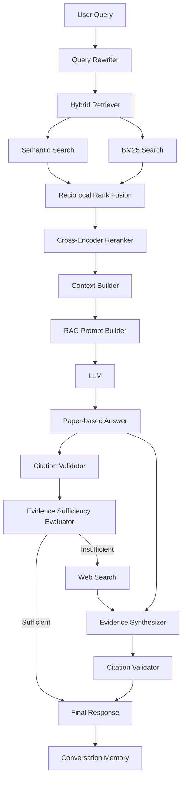

# 🔎 Agentic Research RAG

A general-purpose **agentic research assistant** for querying collections of PDF documents using **hybrid retrieval, semantic search, BM25, Reciprocal Rank Fusion, cross-encoder reranking, grounded generation, citation validation, conversational memory, and web fallback**.

The system follows a **paper-first research strategy**: it always searches the local document corpus first, evaluates whether the retrieved evidence is sufficient to answer the question, and only uses web search when the local evidence is not enough.

The project is designed as a modular, testable RAG architecture rather than a single retrieval script, with explicit abstractions for ingestion, indexing, retrieval, reranking, LLM providers, tools, memory, evidence evaluation, synthesis, and agent orchestration.

---

## 📑 Table of Contents

- [Key Features](#key-features)
- [Quickstart](#-quickstart)
- [Architecture](#architecture)
- [Retrieval Architecture](#retrieval-architecture)
- [Cross-Encoder Reranking](#cross-encoder-reranking)
- [Semantic Index Persistence](#semantic-index-persistence)
- [Document Ingestion](#document-ingestion)
- [Grounded RAG Generation](#grounded-rag-generation)
- [Citation Validation](#citation-validation)
- [Evidence Sufficiency Evaluation](#evidence-sufficiency-evaluation)
- [Paper-First Agent Strategy](#paper-first-agent-strategy)
- [Web Search Fallback](#web-search-fallback)
- [Evidence Synthesis](#evidence-synthesis)
- [Conversational Memory](#conversational-memory)
- [Context-Aware Query Rewriting](#context-aware-query-rewriting)
- [Agent Orchestration](#agent-orchestration)
- [Structured Responses](#structured-responses)
- [Project Structure](#project-structure)
- [Configuration](#configuration)
- [Installation](#installation)
- [Adding Documents](#adding-documents)
- [Building the Research Agent](#building-the-research-agent)
- [Testing](#testing)
- [Testing Strategy](#testing-strategy)
- [Design Principles](#design-principles)
- [Technology Stack](#technology-stack)
- [Current Scope](#current-scope)
- [Known Limitations](#-known-limitations)
- [Potential Extensions](#potential-extensions)
- [Summary](#summary)

---

## Key Features

* PDF ingestion with page-level metadata
* Configurable overlapping text chunking
* Local semantic embeddings
* Persistent semantic vector index
* Corpus fingerprinting and automatic index invalidation
* BM25 lexical retrieval
* Hybrid retrieval with Reciprocal Rank Fusion
* Cross-encoder reranking
* Grounded RAG generation
* Source-level citations
* Citation validation
* Evidence sufficiency evaluation
* Paper-first research workflow
* Web search fallback
* Multi-source evidence synthesis
* Conversational memory
* Context-aware query rewriting
* Provider abstractions for LLMs, embeddings, and web search
* Structured agent responses
* Environment-driven configuration
* Extensive unit test coverage

---

## 🚀 Quickstart

```bash
git clone https://github.com/carlosng95/agentic-research-rag.git
cd agentic-research-rag
python3 -m pip install -e ".[dev]"
cp .env.example .env
```

Set your `OPENAI_API_KEY` in `.env` before running the agent. `Settings.from_env()` reads from `os.getenv()`, so it does not load `.env` automatically — call `load_dotenv()` explicitly, as shown below.

Drop PDFs into `papers/`, then:

```python
from pathlib import Path

from dotenv import load_dotenv

from agentic_research_rag.bootstrap import build_research_agent


load_dotenv()

agent = build_research_agent(
    papers_dir = Path.cwd() / "papers",
    semantic_index_path = Path.cwd() / "data/indexes/semantic_index.npz",
)

response = agent.run(
    query = "How does hybrid retrieval improve document search?"
)

print(response.answer)
```

---

## Architecture

The system is organized as a sequence of independent components rather than a monolithic RAG pipeline.



The high-level execution flow is:

```text
User query
    ↓
Query rewriting
    ↓
Semantic retrieval ──┐
                     ├── Reciprocal Rank Fusion
BM25 retrieval ──────┘
    ↓
Cross-encoder reranking
    ↓
Paper RAG
    ↓
Evidence sufficiency evaluation
    ↓
┌─────────────────────────────┐
│ Is local evidence enough?   │
└─────────────────────────────┘
      │                  │
     Yes                 No
      │                  │
      ▼                  ▼
Final answer         Web search
                         ↓
                Evidence synthesis
                         ↓
                   Final answer
```

---

## Retrieval Architecture

The retrieval layer combines three different ranking mechanisms.

### 1. Semantic Retrieval

Documents are represented using dense embeddings generated by a configurable embedding provider.

The default local embedding model is:

```text
sentence-transformers/all-MiniLM-L6-v2
```

Each chunk is embedded independently and stored in a normalized matrix.

For a query \(q\), the system generates a query embedding and computes similarity against every chunk embedding.

Because both query and document vectors are L2-normalized, cosine similarity becomes equivalent to a dot product:

```text
similarity(q, d) = q · d
```

This architecture is effectively a **bi-encoder retrieval system**:

```text
Query ───────► Encoder ───────► Query Vector
                                   │
                                   │ similarity
                                   ▼
Document ────► Encoder ───────► Document Vector
```

Document embeddings can therefore be computed once and reused across queries.

> **Note:** `all-MiniLM-L6-v2` is English-centric. If your corpus includes non-English papers (e.g. Spanish), consider a multilingual embedding model (e.g. `paraphrase-multilingual-MiniLM-L12-v2`) — see [Known Limitations](#-known-limitations).

---

### 2. BM25 Retrieval

Semantic retrieval is complemented by lexical retrieval using **BM25**.

BM25 is particularly useful when exact terminology matters, such as:

* acronyms
* technical terms
* identifiers
* model names
* uncommon keywords
* domain-specific terminology

The project uses:

```text
rank-bm25
```

with a pluggable tokenizer abstraction.

Two tokenizer implementations are included:

```text
RegexTokenizer
WhitespaceTokenizer
```

The default approach uses regular-expression tokenization and lowercase normalization. Neither tokenizer applies stopword removal or stemming, so lexical recall on morphologically richer languages (e.g. Spanish) will be weaker than on English.

---

### 3. Reciprocal Rank Fusion

Semantic similarity scores and BM25 scores are not directly comparable because they belong to different scoring spaces.

Instead of attempting to normalize them, the system uses **Reciprocal Rank Fusion (RRF)**.

For each result at rank \(rank\):

```text
RRF score = 1 / (rrf_k + rank)
```

where `rrf_k` is the rank-smoothing constant (`RRF_K`, 60 by default) — named distinctly from `RETRIEVAL_CANDIDATE_K`, `RERANK_K`, and `FINAL_K` to avoid confusion with the other `K` values used for top-K cutoffs elsewhere in the pipeline.

A document appearing in multiple rankings accumulates contributions from each ranking.

Conceptually:

```text
Semantic ranking          BM25 ranking

1. Chunk A               1. Chunk D
2. Chunk B               2. Chunk A
3. Chunk C               3. Chunk C
       │                       │
       └──────────┬────────────┘
                  ▼
         Reciprocal Rank Fusion
                  │
                  ▼
              Chunk A
              Chunk C
              Chunk D
              Chunk B
```

This provides a robust way to combine semantic and lexical retrieval without requiring score calibration.

The default configuration is:

```text
Semantic retrieval → Top 30
BM25 retrieval     → Top 30
RRF fusion         → Top 20
Cross-encoder      → Top 5
```

All values are configurable through environment variables.

---

## Cross-Encoder Reranking

The fused candidates are passed to a **cross-encoder reranker**.

Unlike a bi-encoder, where query and document are encoded independently, the cross-encoder processes them together:

```text
[Query, Document]
        │
        ▼
 Transformer
        │
        ▼
Relevance Score
```

The default model is:

```text
cross-encoder/ms-marco-MiniLM-L6-v2
```

This architecture is computationally more expensive than vector similarity, but it provides stronger relevance estimation.

For that reason it is only applied to the relatively small candidate set produced by hybrid retrieval.

```text
Large corpus
    ↓
Fast retrieval
    ↓
Top candidates
    ↓
Expensive cross-encoder
    ↓
Highly relevant final context
```

This follows a common two-stage information retrieval architecture:

```text
Candidate generation → Reranking
```

---

## Semantic Index Persistence

Generating embeddings for the entire corpus every time the application starts would be unnecessary.

The semantic index can therefore be persisted as:

```text
data/indexes/semantic_index.npz
```

The persisted index contains:

* embedding matrix
* corpus fingerprint
* embedding model identifier
* chunk count

The corpus fingerprint is generated from chunk metadata and content.

When loading an existing index, the application verifies:

```text
Current corpus fingerprint
        ==
Stored corpus fingerprint
```

as well as:

```text
Current embedding model
        ==
Stored embedding model
```

If either condition fails, the index is considered stale and is rebuilt automatically.

```text
Index exists?
     │
     ├── No ─────► Build → Save
     │
     └── Yes
          │
          ▼
     Validate index
          │
       ┌──┴──┐
       │     │
     Valid  Stale
       │     │
       ▼     ▼
     Load   Rebuild
```

This prevents silently using embeddings generated from a different corpus or embedding model.

---

## Document Ingestion

PDF documents are loaded page by page using:

```text
pypdf
```

Each page becomes a structured object:

```python
Page(
    document_name = "...",
    page_number = 1,
    text = "...",
)
```

Pages are then divided into overlapping chunks.

Default configuration:

```text
CHUNK_SIZE=1200
CHUNK_OVERLAP=200
```

For a chunk size \(C\) and overlap \(O\):

```text
step = C - O
```

Conceptually:

```text
Document text
───────────────────────────────────────────────

Chunk 1
████████████████

             Chunk 2
             ████████████████

                          Chunk 3
                          ████████████████
```

The overlap reduces information loss around artificial chunk boundaries.

> **Note:** chunking is character-based rather than tokenizer-aware, so the number of model tokens per chunk can vary across languages and content types — a chunk sized safely for English may run closer to the embedding model's token limit for other languages. Overlap is also page-local: it does not carry across page boundaries. Token-based chunking is a straightforward future improvement (see [Known Limitations](#-known-limitations)).

Chunks preserve:

* global chunk identifier
* document name
* page number
* text
* optional ranking score

Chunk identifiers are global across the complete corpus.

---

## Grounded RAG Generation

After reranking, the highest-ranked chunks are converted into an explicit context format:

```text
[SOURCE 1]

Document: example.pdf
Page: 4
Chunk ID: 37

Retrieved evidence...

---

[SOURCE 2]

Document: another_document.pdf
Page: 9
Chunk ID: 104

Retrieved evidence...
```

The LLM is instructed to:

* answer only using the provided evidence
* avoid unsupported external knowledge
* explicitly acknowledge insufficient context
* cite evidence using `[SOURCE N]`
* avoid inventing citations
* produce concise research-oriented answers

The result is then converted into a structured `ResearchResponse`.

---

## Citation Validation

Generated answers are automatically checked for citation consistency.

The validator extracts citations such as:

```text
[SOURCE 1]
[SOURCE 3]
```

and verifies that they correspond to sources that actually exist in the generated context.

Possible flags include:

```text
missing_citations
invalid_source_8
```

For example, if the context contains only:

```text
SOURCE 1
SOURCE 2
SOURCE 3
```

but the model generates:

```text
[SOURCE 8]
```

the response is flagged as:

```text
invalid_source_8
```

This provides a lightweight guard against citation hallucination. It is **structural, not semantic** — it confirms a cited source exists, not that the source actually supports the claim attributed to it. See [Known Limitations](#-known-limitations).

---

## Evidence Sufficiency Evaluation

Retrieving documents does not necessarily mean that those documents are sufficient to answer the question.

After the paper-based RAG response is generated, a dedicated evaluator determines whether the available evidence is sufficient.

The evaluator receives:

```text
User question
+
Retrieved evidence
```

and produces one of two decisions:

```text
SUFFICIENT
```

or:

```text
INSUFFICIENT
```

If no sources were retrieved, the evaluator immediately returns insufficient without invoking the LLM.

This decision controls whether external research is necessary.

> **Cost note:** as implemented, this is a separate LLM call from the answer-generation step. It can be folded into the same call (have the generation prompt also return a `sufficient` field as structured output) to cut one round-trip per query in the common case where local evidence is enough.

---

## Paper-First Agent Strategy

A central design decision in this project is that **web search is not the primary retrieval mechanism**.

The agent always searches the local document corpus first.

```text
Query
  ↓
Local documents
  ↓
Evidence evaluation
```

Only when the evidence is insufficient does the agent execute:

```text
Web search
```

This produces the following agent loop:

```text
Action: search local documents
        ↓
Observation: retrieved evidence
        ↓
Decision: is evidence sufficient?
        │
    ┌───┴────┐
    │        │
   Yes       No
    │        │
    ▼        ▼
 Answer   Action: web search
             ↓
         Observation
             ↓
          Synthesis
```

This makes the system agentic without requiring unrestricted autonomous tool execution.

---

## Web Search Fallback

When local evidence is insufficient, the research agent can invoke a web search provider.

The default implementation uses the OpenAI Responses API with the built-in:

```text
web_search
```

tool.

The web provider returns:

```python
answer: str
sources: list[Source]
```

Web citations are converted to the same `Source` abstraction used by local documents.

This means downstream components do not need separate data structures for local and web evidence.

---

## Evidence Synthesis

When web fallback is required, the original paper evidence is **not discarded**.

Instead, both evidence sets are passed to the `EvidenceSynthesizer`:

```text
Paper evidence ────┐
                   ├──► Evidence Synthesizer
Web evidence ──────┘
```

The synthesizer:

1. combines paper and web sources
2. removes duplicate sources
3. renumbers sources into a unified citation space
4. prefers direct document evidence when appropriate
5. uses web evidence to complement missing information
6. generates a new grounded answer
7. validates the final citations

This prevents the web fallback from replacing useful evidence already found in the local corpus.

---

## Conversational Memory

The system supports multi-turn research conversations.

Conversation history is stored as structured turns:

```python
Turn(
    role = "user",
    content = "...",
)
```

and:

```python
Turn(
    role = "assistant",
    content = "...",
)
```

Memory has a configurable maximum number of turns:

```text
MEMORY_TURNS=5
```

Older messages are automatically removed once the configured history window is exceeded.

Memory is not just an append-only log — it feeds back into the next turn:

```text
Turn N
  ↓
Final response saved to memory
  ↓
Turn N+1 arrives
  ↓
Query Rewriter reads memory ──► standalone query for retrieval
```

This is what makes the [Context-Aware Query Rewriting](#context-aware-query-rewriting) step below possible: without this feedback loop, the rewriter would have no prior context to resolve ambiguous follow-ups against.

---

## Context-Aware Query Rewriting

Follow-up questions frequently depend on previous conversation context.

For example:

```text
User:
How does semantic search retrieve documents?

Assistant:
...

User:
And how does it differ from lexical search?
```

The second query alone is ambiguous.

Before retrieval, the query rewriter converts it into a standalone research query such as:

```text
How does semantic search differ from lexical document retrieval?
```

The rewritten query is used for retrieval, while the **original user message** is stored in conversation memory.

This separates:

```text
Conversation representation
```

from:

```text
Retrieval representation
```

If no conversation history exists, the query is returned unchanged and no additional LLM call is made.

---

## Agent Orchestration

`ResearchAgent` coordinates the complete workflow:

```python
standalone_query = query_rewriter.rewrite(...)

paper_response = paper_tool.run(
    query = standalone_query,
)

sufficient = sufficiency_evaluator.is_sufficient(
    query = standalone_query,
    response = paper_response,
)

if sufficient:
    final_response = paper_response
else:
    web_response = web_tool.run(
        query = standalone_query,
    )

    final_response = synthesizer.synthesize(
        query = standalone_query,
        paper_response = paper_response,
        web_response = web_response,
    )
```

The agent also records which tools were actually executed:

```python
tools_used = [
    "paper_search",
]
```

or:

```python
tools_used = [
    "paper_search",
    "web_search",
]
```

This makes execution behavior observable without exposing internal model reasoning.

---

## Structured Responses

The application returns a structured response instead of only raw text.

```python
@dataclass
class ResearchResponse:
    answer: str
    sources: list[Source]
    reasoning_steps: list[str]
    tools_used: list[str]
    confidence: float
    flags: list[str]
```

Example:

```python
ResearchResponse(
    answer = "...",
    sources = [...],
    reasoning_steps = [
        "Retrieved and reranked document chunks.",
        "Generated the answer using retrieved context.",
    ],
    tools_used = [
        "paper_search",
    ],
    confidence = 0.0,
    flags = [],
)
```

`reasoning_steps` represent an **operational execution trace**, not hidden model chain-of-thought.

The current implementation intentionally does not treat cross-encoder relevance scores as calibrated probabilities, so `confidence` is hardcoded to `0.0` and not derived from anything yet.

---

## Project Structure

```text
agentic-research-rag/
│
├── agentic_research_rag/
│   ├── agents/
│   │   └── research_agent.py
│   │
│   ├── evaluation/
│   │   └── sufficiency.py
│   │
│   ├── fusion/
│   │   └── rrf.py
│   │
│   ├── indexing/
│   │   ├── bm25_index.py
│   │   ├── semantic_index.py
│   │   └── semantic_index_manager.py
│   │
│   ├── ingestion/
│   │   ├── chunker.py
│   │   ├── corpus.py
│   │   └── pdf_loader.py
│   │
│   ├── providers/
│   │   ├── embeddings.py
│   │   ├── llm.py
│   │   └── websearch.py
│   │
│   ├── reranking/
│   │   ├── base.py
│   │   └── cross_encoder.py
│   │
│   ├── synthesis/
│   │   └── evidence.py
│   │
│   ├── tools/
│   │   ├── base.py
│   │   ├── paper_rag.py
│   │   └── websearch.py
│   │
│   ├── bootstrap.py
│   ├── citation_validator.py
│   ├── config.py
│   ├── context_builder.py
│   ├── memory.py
│   ├── prompt_builder.py
│   ├── query_rewriter.py
│   ├── rag_pipeline.py
│   ├── retrieval_pipeline.py
│   ├── retriever.py
│   ├── tokenizer.py
│   └── types.py
│
├── tests/
│   ├── fakes.py
│   ├── test_bm25_index.py
│   ├── test_chunker.py
│   ├── test_citation_validator.py
│   ├── test_config.py
│   ├── test_context_builder.py
│   ├── test_corpus.py
│   ├── test_cross_encoder.py
│   ├── test_evidence_synthesizer.py
│   ├── test_memory.py
│   ├── test_pdf_loader.py
│   ├── test_prompt_builder.py
│   ├── test_query_rewriter.py
│   ├── test_rag_pipeline.py
│   ├── test_research_agent.py
│   ├── test_retrieval_pipeline.py
│   ├── test_retriever.py
│   ├── test_rrf.py
│   ├── test_semantic_index.py
│   ├── test_semantic_index_manager.py
│   ├── test_sufficiency.py
│   └── test_tokenizer.py
│
├── papers/
│   └── .gitkeep
│
├── data/
│   └── indexes/
│       └── .gitkeep
│
├── .env.example
├── .gitignore
├── pyproject.toml
└── README.md
```

PDF documents, generated indexes, development notebooks, secrets, and local IDE artifacts are intentionally excluded from version control.

---

## Configuration

Create a local `.env` file based on:

```text
.env.example
```

Example:

```env
OPENAI_API_KEY=

LOCAL_EMBEDDING_MODEL=sentence-transformers/all-MiniLM-L6-v2
OPENAI_EMBEDDING_MODEL=text-embedding-3-small
CROSS_ENCODER_MODEL=cross-encoder/ms-marco-MiniLM-L6-v2
LLM_MODEL=gpt-4o-mini

CHUNK_SIZE=1200
CHUNK_OVERLAP=200

RRF_K=60

RETRIEVAL_CANDIDATE_K=30
RERANK_K=20
FINAL_K=5

MEMORY_TURNS=5
```

Configuration is loaded into an immutable `Settings` dataclass and validated at startup.

Examples of invalid configurations include:

```text
CHUNK_OVERLAP >= CHUNK_SIZE

RERANK_K > RETRIEVAL_CANDIDATE_K

FINAL_K > RERANK_K
```

These conditions fail early instead of producing unexpected runtime behavior.

---

## Installation

Clone the repository:

```bash
git clone https://github.com/carlosng95/agentic-research-rag.git
cd agentic-research-rag
```

Create and activate a Python environment, then install the project in editable mode:

```bash
python3 -m pip install -e ".[dev]"
```

The project requires Python:

```text
>= 3.11
```

---

## Adding Documents

Place PDF documents inside:

```text
papers/
```

For example:

```text
papers/
├── document_1.pdf
├── document_2.pdf
└── document_3.pdf
```

PDF files are intentionally ignored by Git so users can supply their own document corpus.

The semantic index is created automatically and stored under:

```text
data/indexes/
```

Generated indexes are also excluded from version control.

---

## Building the Research Agent

The complete application is assembled through the composition root in:

```text
agentic_research_rag/bootstrap.py
```

Example:

```python
from pathlib import Path

from agentic_research_rag.bootstrap import build_research_agent


PROJECT_ROOT = Path.cwd()

agent = build_research_agent(
    papers_dir = PROJECT_ROOT / "papers",
    semantic_index_path = PROJECT_ROOT / "data/indexes/semantic_index.npz",
)
```

Then run a research query:

```python
response = agent.run(
    query = "How does hybrid retrieval improve document search?"
)

print(response.answer)
```

Inspect sources:

```python
for source in response.sources:
    print(
        source.type,
        source.ref,
        source.locator,
    )
```

Inspect executed tools:

```python
print(response.tools_used)
```

Possible result:

```text
['paper_search']
```

or, when local evidence is insufficient:

```text
['paper_search', 'web_search']
```

---

## Testing

The project contains an extensive unit test suite covering the main architecture.

Run all tests with:

```bash
python3 -m pytest
```

Current suite:

```text
164 passed
```

The tests cover:

* configuration validation
* PDF loading
* document chunking
* global chunk IDs
* tokenization
* BM25 indexing
* semantic index construction
* embedding normalization
* semantic search
* semantic index persistence
* corpus fingerprint validation
* embedding model mismatch detection
* automatic index rebuilding
* Reciprocal Rank Fusion
* hybrid retrieval
* cross-encoder reranking
* context construction
* prompt construction
* citation extraction
* citation validation
* RAG orchestration
* conversation memory
* query rewriting
* evidence sufficiency
* evidence synthesis
* research agent control flow
* web fallback behavior

External models and APIs are replaced with deterministic test doubles where appropriate, allowing most application logic to be tested without network calls or model downloads.

---

## Testing Strategy

The test architecture intentionally separates application logic from external dependencies.

For example:

```text
Real LLM Provider
       ▲
       │ abstraction
       ▼
Fake LLM Provider
```

The fake provider records prompts and returns deterministic responses.

This makes it possible to test behaviors such as:

```text
Query rewriting
Citation validation
Evidence sufficiency
Agent routing
Evidence synthesis
```

without relying on:

```text
OpenAI API availability
network access
model randomness
external model downloads
```

The same strategy is used for:

* embedding providers
* semantic indexes
* BM25 indexes
* retrievers
* rerankers
* web tools

This keeps the unit test suite fast and deterministic.

---

## Design Principles

### Modular Components

Each component has one primary responsibility.

```text
PDF Loader      → document extraction
Chunker         → text segmentation
Semantic Index  → vector retrieval
BM25 Index      → lexical retrieval
RRF             → rank fusion
Reranker        → relevance refinement
RAG Pipeline    → grounded generation
Evaluator       → evidence sufficiency
Synthesizer     → multi-source generation
Research Agent  → workflow orchestration
```

---

### Dependency Injection

Core components receive their dependencies through constructors.

For example:

```python
RetrievalPipeline(
    retriever = retriever,
    reranker = reranker,
    candidate_k = 30,
    rerank_k = 20,
    final_k = 5,
)
```

This makes implementations replaceable and significantly improves testability.

---

### Provider Abstractions

External services are hidden behind interfaces such as:

```text
EmbeddingProvider
LLMProvider
WebSearchProvider
Reranker
Tokenizer
Tool
```

Business logic therefore does not depend directly on a specific model vendor or implementation.

---

### Fail Fast Configuration

Configuration errors are validated during initialization rather than appearing later during query execution.

---

### Immutable Retrieval Results

Search components use `dataclasses.replace()` when assigning ranking scores instead of mutating the original corpus chunks.

This keeps the underlying corpus stable across multiple retrieval stages.

---

### Paper-First Research

Local evidence remains the primary source of truth.

Web search is treated as a fallback mechanism instead of an unconditional retrieval source.

---

### Explicit Grounding

Sources are represented explicitly and propagated through the entire generation pipeline.

This allows citations to be validated after generation.

---

## Technology Stack

| Layer                   | Technology                  |
| ----------------------- | --------------------------- |
| Language                | Python 3.11+                |
| PDF ingestion           | pypdf                       |
| Semantic embeddings     | Sentence Transformers       |
| Default embedding model | all-MiniLM-L6-v2            |
| Lexical retrieval       | BM25                        |
| Rank fusion             | Reciprocal Rank Fusion      |
| Reranking               | Cross-Encoder               |
| Default reranker        | ms-marco-MiniLM-L6-v2       |
| LLM integration         | OpenAI Responses API        |
| Web research            | OpenAI Web Search           |
| Vector operations       | NumPy                       |
| Configuration           | python-dotenv               |
| Testing                 | pytest                      |
| Packaging               | setuptools / pyproject.toml |

---

## Current Scope

The project currently focuses on the core research and retrieval architecture.

It intentionally does not depend on:

* a web framework
* a frontend
* a database server
* a dedicated vector database
* an orchestration framework

For small and medium document collections, the semantic index currently uses a normalized NumPy matrix.

This keeps the retrieval implementation transparent and easy to inspect.

For substantially larger corpora, the semantic retrieval layer could be replaced with an approximate nearest-neighbor backend such as FAISS or a dedicated vector database without changing the higher-level agent architecture.

---

## ⚠️ Known Limitations

These are current, deliberate trade-offs rather than bugs — worth knowing before relying on the system in production:

* **Citation validation is structural, not semantic.** A cited `[SOURCE N]` is checked for existence, not for whether it actually supports the claim next to it. Hallucinated claims attached to a real, existing source will pass validation.
* **`confidence` is not calibrated and is currently always `0.0`.** Don't use it for filtering or ranking answers yet.
* **Chunking is character-based.** Chunk boundaries are based on character counts rather than the embedding model's tokenizer, so token counts can vary across languages and content types. Overlap is also page-local — it does not carry across page boundaries.
* **BM25 tokenization has no stopword removal or stemming.** Lexical recall will be weaker for morphologically rich languages (e.g. Spanish, German) than for English.
* **PDF extraction is text-only.** Scanned or image-only PDFs require OCR, which is not currently included. Complex or multi-column layouts may also reduce text extraction quality.
* **Per-query LLM call count can reach 4–5** (rewrite, generate, sufficiency check, web search, synthesis) in the worst case. At scale this is a real latency/cost driver worth optimizing before the "REST API layer" extension below.
* **No rate limiting or concurrency control** around the LLM/embedding/web-search providers — fine for single-user/local use, a gap for multi-user deployment.

---

## Potential Extensions

Possible future improvements include:

* FAISS-based approximate nearest-neighbor retrieval
* persistent conversational memory
* asynchronous retrieval and tool execution
* streaming responses
* metadata filtering
* document-level retrieval constraints
* more sophisticated citation entailment checks
* calibrated confidence estimation
* evaluation datasets for retrieval quality
* Recall@K / MRR / nDCG retrieval metrics
* RAG evaluation pipelines
* multiple web search providers
* additional document formats
* REST API layer
* interactive frontend
* Docker deployment
* observability and tracing

---

## Summary

This project demonstrates an end-to-end agentic RAG architecture built around a few core ideas:

```text
Hybrid retrieval
        +
Cross-encoder reranking
        +
Grounded generation
        +
Citation validation
        +
Evidence evaluation
        +
Conditional web research
        +
Conversational context
```

Rather than treating RAG as simply:

```text
embed → retrieve → prompt
```

the system implements a multi-stage research workflow in which retrieval quality, evidence sufficiency, source provenance, conversation context, and fallback behavior are handled as explicit architectural components.